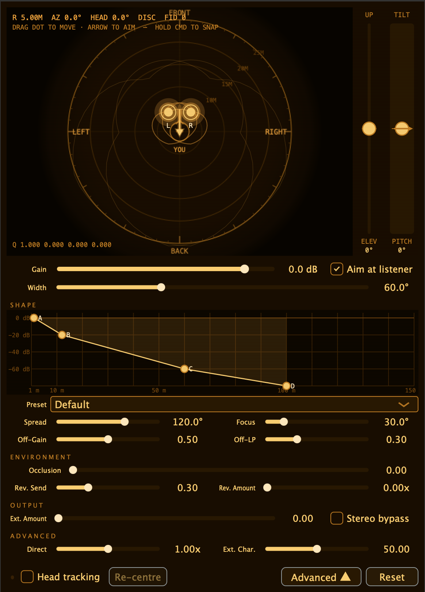

# Spatial Audio Engine

Rust spatial-audio engine with a JUCE Audio Unit front-end, based on an existing spatial rendering design.




Current repo focus:
- `crates/engine`: realtime binaural rendering engine
- `juce/`: macOS AU + standalone app wrapper

## Features

- Fixed 128-sample realtime processing core
- Binaural decode with bundled HRTF assets
- Per-source position, gain, orientation, occlusion, and directivity
- Reverb and externalizer stages
- Stereo-width control and world/head-locked behavior
- Distance-curve editing in the plugin UI
- OSC-driven head tracking support in the JUCE plugin
- Rust API plus optional C ABI (`--features c-api`)

## Repo Layout

- `crates/engine` - core DSP engine
- `crates/engine/include/engine.h` - C header for the engine staticlib
- `juce` - AU/Standalone wrapper built with JUCE
- `data` - HRTF/filter assets used by the current build
- `crates/cli` - placeholder for an offline renderer
- `crates/cpal-demo` - placeholder for a native realtime demo
- `crates/vst` - placeholder crate; no active plugin implementation here

## Requirements

- Rust toolchain
- CMake 3.22+
- Ninja
- Xcode command line tools
- macOS 11+

## Build And Test

Run engine tests:

```bash
cargo test --workspace
```

Build the JUCE plugin from the canonical build dir:

```bash
cmake -S juce -B juce/build -G Ninja -DCMAKE_BUILD_TYPE=Release
cmake --build juce/build --config Release
```

Build output:

```text
juce/build/SpatialAudioEngine_artefacts/Release/AU/Spatial Audio Engine.component
```

The JUCE target is configured with `COPY_PLUGIN_AFTER_BUILD`, so a successful build also installs the AU to:

```text
~/Library/Audio/Plug-Ins/Components/Spatial Audio Engine.component
```

## Engine Build Only

Build the Rust engine staticlib and C ABI:

```bash
cargo build --release -p engine --features c-api
```

Header:

```text
crates/engine/include/engine.h
```

Static library:

```text
target/release/libengine.a
```

## Head Tracking

The JUCE plugin listens for OSC head-pose updates on UDP port `9000`.
Expected message:

```text
/headpose  w x y z
```

where `w x y z` is a quaternion in scalar-first order.

Two ways to drive it:

1. Send `/headpose` OSC messages from your own tracker source.
2. Use the included Buds bridge in `juce/tools/buds_daemon`.

Build the Buds bridge:

```bash
./juce/tools/buds_daemon/build.sh
```

Run it:

```bash
./juce/tools/buds_daemon/buds_daemon
```

Notes:

- Default destination is `127.0.0.1:9000`.
- The daemon looks for paired Buds devices and forwards motion as OSC.
- If another app already owns the RFCOMM connection, the daemon may fail to attach.
- In the plugin UI, enable head tracking and use the re-centre control to zero the current pose.
- Protocol notes and packet details: [headtracking protocol notes](juce/docs/headtracking_protocol.md)

## Current Status

- Engine tests are in place and passing
- AU build/install flow is working from `juce/build`
- AU is currently the main supported host target
- `cli`, `cpal-demo`, and `vst` are not finished products yet
- The current build uses bundled HRTF/filter assets while replacement data is being evaluated

## Notes

- The engine processes audio in 128-sample blocks; the JUCE wrapper handles host block adaptation.
- The current plugin build expects the HRTF/filter files in `data/` to be present.

## License

Unless otherwise noted, the source code in this repository is licensed under MIT.

Binary asset files under `data/` are not covered by the code license in this repository.
